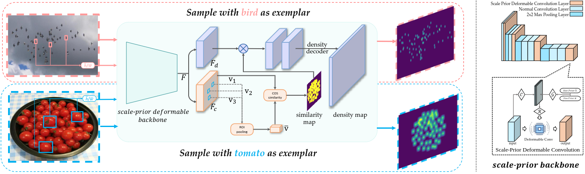

# SPDCN

[[Homepage](https://bmvc2022.mpi-inf.mpg.de/313/)][[paper](https://bmvc2022.mpi-inf.mpg.de/0313.pdf)][[Poster](https://bmvc2022.mpi-inf.mpg.de/0313_poster.pdf)]

official code for BMVC-2022 paper "Scale-Prior Deformable Convolution for Exemplar-Guided Class-Agnostic Counting"



# Requirement

We use [Singularity](https://docs.sylabs.io/guides/3.3/user-guide/index.html) to build the enviroment. Download our enviroment: [excalibur.sif](https://portland-my.sharepoint.com/:u:/g/personal/wlin38-c_my_cityu_edu_hk/ESJUgH4yrsxPoZlOEfA9dCYBweBOif4vKVsBgRNqJH6E8Q?e=lWuBJH).
If you'd like to create environement yourself, the following python packages are required:
```
pytorch == 1.9.0
torchvision == 0.10.0
mmcv == 1.3.13
timm == 0.4.12
termcolor
yacs
einops
```

# Data Preparation

- Download [FSC-147](https://github.com/cvlab-stonybrook/LearningToCountEverything)
- modify the `root` in line 12 of `datasets/gendata384x576.py` to the local path of FSC-147.
- running the file `datasets/gendata384x576.py`

# Training

- modify the `datapath` in `run.sh` to the local path of FSC-147 dataset
- using singularity: `singularity exec --bind  --nv path_to_excalibur.sif ./run.sh`
- using your own environment: `./run.sh`

A training log is shown in `md-files/training.log`, and corresponding checkpoint is uploaded [here](https://github.com/Elin24/SPDCN-CAC/releases/tag/checkpoint).

# Inference Demo

A demo is presented in `demo.ipynb`. You can let `config.resume` in it be the path to the checkpoint and know about how to run our model.

# Citation

```
@inproceedings{Lin_2022_BMVC,
author    = {Wei Lin and Kunlin Yang and Xinzhu Ma and Junyu Gao and Lingbo Liu and Shinan Liu and Jun Hou and Shuai Yi and Antoni Chan},
title     = {Scale-Prior Deformable Convolution for Exemplar-Guided Class-Agnostic Counting},
booktitle = {33rd British Machine Vision Conference 2022, {BMVC} 2022, London, UK, November 21-24, 2022},
publisher = {{BMVA} Press},
year      = {2022},
url       = {https://bmvc2022.mpi-inf.mpg.de/0313.pdf}
}
```


